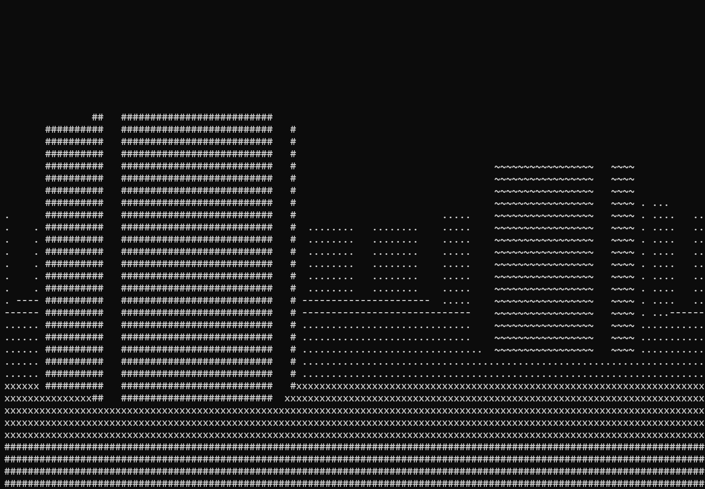
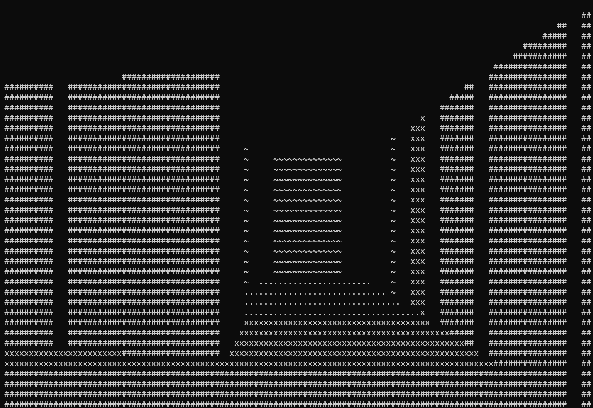

# 3D ASCII Maze Game

This is a 3D ASCII-based game where you navigate through a randomly generated maze using simple keyboard controls. The game renders a first-person perspective of the maze using ASCII characters.

## Screenshots
    

    


## Features

- **Random Maze Generation**: Every time you play, the maze is randomly generated, providing a new experience each time. Additionally, you can regenerate the maze layout while playing.
- **3D ASCII Rendering**: The game provides a pseudo-3D experience using ASCII characters to render walls and open spaces.

## Controls

- `W` - Move forward
- `S` - Move backward
- `A` - Rotate left
- `D` - Rotate right
- `E` - Regenerate a new maze
- `Ctrl+C` - Exit the game

## Requirements

- **C Compiler**: GCC compiler.

## Installation

1. Clone the repository or download the source code.
    ```bash
    git clone https://github.com/Radu214/3D-ASCII-GAME.git
    ```
	
2. Compile the program using the following command:

    ```bash
    make
    ```

3. Run the game:

    ```bash
    make run 
    ```
4. After exiting the game
	 ```bash
    make clean 
    ```

## Known Issues

- Upon regenerating the maze layout, the player might get stuck. This can be easily resolved by regenerating the maze again.  
- Since the maze is randomly generated, the player could spawn facing one or multiple walls, which may give the false impression that the maze is not properly displayed.

## Acknowledgements 
- This project incorporates the 3D rendering technique and character movement from a tutorial by [javidx9](https://www.youtube.com/@javidx9). The original tutorial was in C++, and I adapted the concepts to C for this implementation. Special thanks to javidx9 for the insightful guidance and clear explanations.
